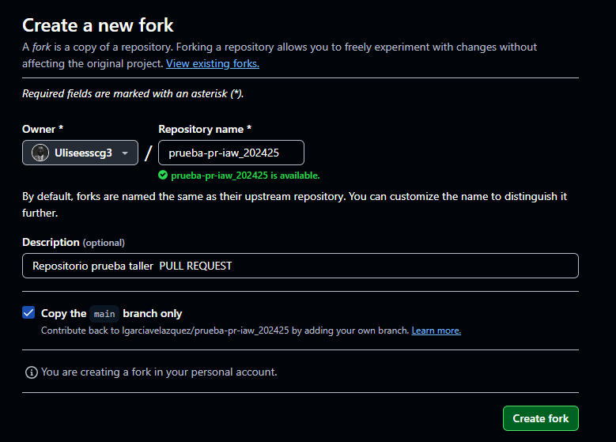
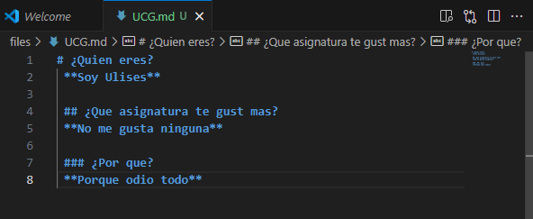
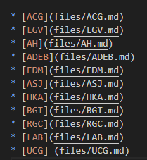
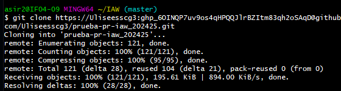
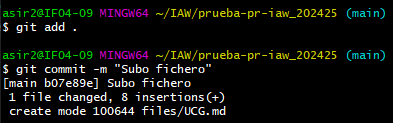
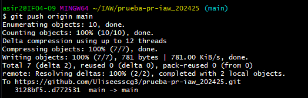
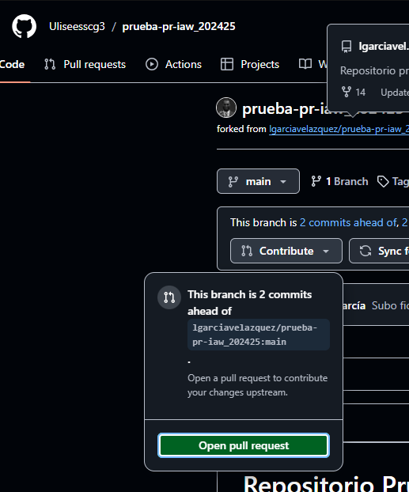
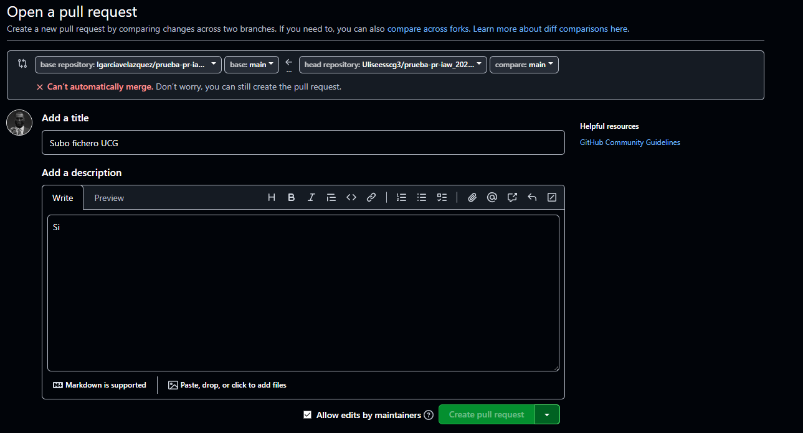

# Ejercicio 4

1. Fork repositorio principal.
   
Lo primero que haremos será entrar al repositorio dado en el ejercicio y crearemos un fork.

2. Creacion fichero.

Despues creamos un fichero para que podamos hacer el pull request.

3. Subir cambios.

4. Pull request.
   
Le pedimos al administrador del repositorio que nos acepte los cambios realizados.

